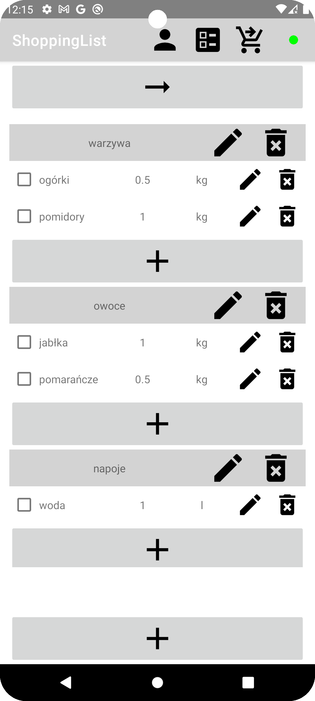
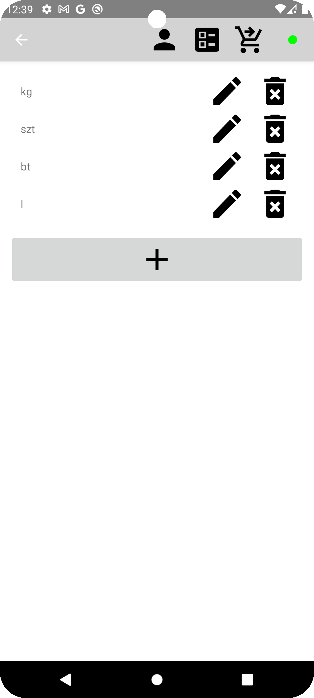
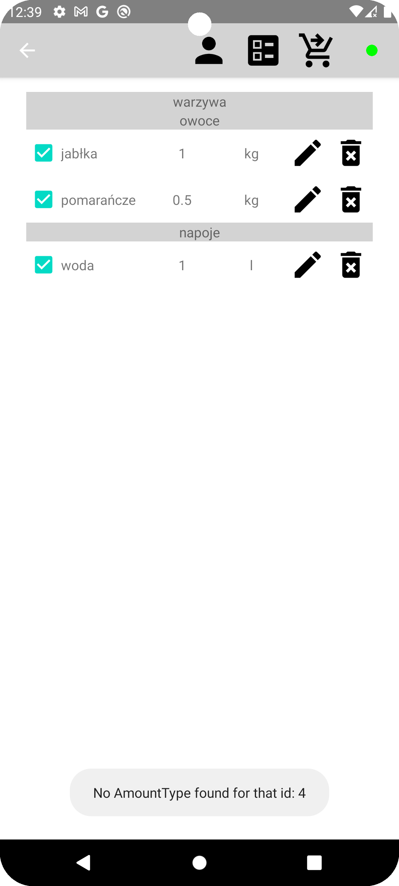
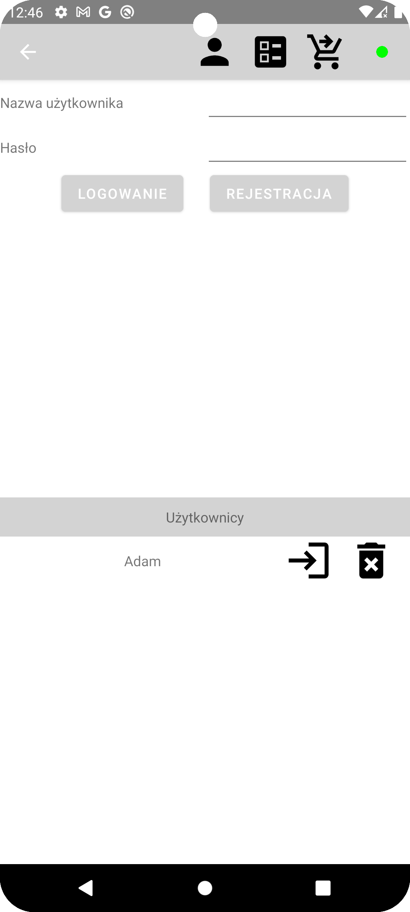

# ShoppingList

Mobile shopping list manager with real-time synchronization and offline support.
Part of a microservice ecosystem including a backend, auth service, recipe service, and a web frontend.

## Features

- **Shopping list management** – create, update, delete shopping items organized by categories with drag-to-reorder
- **Measurement units** – define and manage amount types with conflict resolution on delete (reassign, cascade delete, or cancel)
- **Bought items history** – track purchased items with sorting and automatic cleanup
- **Recipes** – browse, search (by name, ingredients, tags with AND/OR logic), create and view recipes with pagination
- **User recipe collection** – save and remove recipes to/from your personal collection
- **Add ingredients to shopping list** – directly from any recipe view
- **Recipe source & publishing** – optional source field and published/unpublished toggle per recipe
- **Offline-first** – fully functional without internet; syncs automatically when connection is restored
- **Real-time sync** – WebSocket protocol synchronizes data across devices instantly; auto-reconnects after token refresh
- **Multi-user** – multiple local accounts with isolated data; optional or forced login flow
- **Encrypted local storage** – Room database encrypted with SQLCipher (AES-256, key stored in Android KeyStore)
- **Interactive tutorial** – overlay guide on first launch
- **Exception logging** – uncaught exceptions are reported to the backend
- **Dark mode support**
- **About screen**

## Architecture

MVVM + Repository pattern with manual dependency injection.

| Layer | Technology |
|-------|-----------|
| Local database | Room + SQLCipher |
| HTTP client | Retrofit 2 + OkHttp |
| Real-time | Custom WebSocket (STOMP-like framed protocol) |
| Auth | JWT (access + refresh token) |
| Pagination | Paging 3 (Guava integration) |
| Navigation | Android Navigation Component (fragments) |
| DI | Manual (singleton repositories) |

JWT tokens are automatically attached to requests via `JwtTokenInterceptor` and refreshed on 401 via `TokenAuthenticator`.
WebSocket reconnects with the new token after refresh.

## Ecosystem (microservices)

The app communicates with three backend services and pairs with a web frontend:

```
                    ┌─────────────────────┐
                    │  ShoppingSecService  │
                    │  (auth, port 4443)   │
                    └──────────┬──────────┘
                               │
          ┌────────────────────┼────────────────────┐
          │ REST               │ REST                │ WS
          ▼                    ▼                     ▼
 ┌────────────────┐ ┌──────────────────┐ ┌──────────────────┐
 │ShoppingListWeb │ │ShoppingList      │ │ShoppingListService│
 │(Angular 21 SPA)│ │(this Android app)│ │(shopping backend)│
 │                │ │                  │ │port 5443         │
 └────────────────┘ └──────────────────┘ └──────────────────┘
          │                    │
          └────────REST────────┘
                               │
                    ┌──────────┴──────────┐
                    │ShoppingListRecipes  │
                    │Service (port 6443)  │
                    └─────────────────────┘
```

## Build variants

Two build flavors with different server URLs:

| Variant | WebSocket | HTTP | Server addresses |
|---------|-----------|------|-----------------|
| Debug | `ws://` | `http://` | Local network (192.168.0.13) |
| Release | `wss://` | `https://` | `*.kamjer.online` |

## Screenshots






## Tech stack

- **Language:** Java 17
- **Min SDK:** 26 | **Target SDK:** 35 | **Version:** 3.0 (code 31)
- **UI:** Material Design 3, RecyclerView, Navigation Component (fragments)
- **Persistence:** Room, SQLCipher
- **Networking:** Retrofit 2, OkHttp, Gson
- **Pagination:** Paging 3 (runtime + Guava)
- **Real-time:** OkHttp WebSocket (custom framed STOMP-like protocol)
- **Auth:** JWT (JJWT on server side)
- **Boilerplate:** Lombok
- **Build:** Gradle Kotlin DSL, version catalog

---

## Privacy Policy

Detailed information about data processing can be found here:
[Privacy Policy](PRIVACY_POLICY.md)

## Account Deletion

If you want to delete your account and associated data, follow the instructions here:
[Account Deletion](ACCOUNT_DELETION.md)

## Contact

For questions or concerns: [kamjersoft@gmail.com](mailto:kamjersoft@gmail.com)
